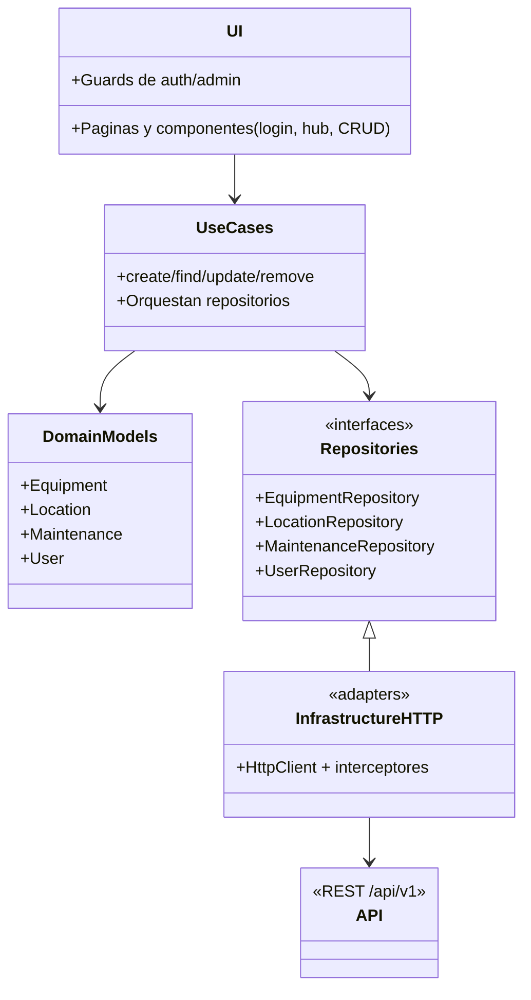

# Modulo de Gestion de Inventario y Mantenimientos (Frontend Angular 20)

## 1. URL de la pagina
- Produccion: pendiente de despliegue (configurar dominio y backend).
- Desarrollo local: http://localhost:4200 ejecutando `npm start` con proxy a la API.

## 2. Descripcion del proyecto
Aplicacion web para administrar el inventario de equipos informaticos y registrar mantenimientos preventivos/correctivos, con control de ubicaciones y usuarios. Utiliza Angular 20, RxJS y un enfoque por capas (UI, casos de uso, dominio, infraestructura) para separar logica de presentacion y de negocio. Incluye autenticacion con token, proteccion de rutas y consumo de una API REST (`/api/v1`).

## 3. Estructura del proyecto
```text
src/
  app/
    application/use-cases/    # Casos de uso por agregado (equipment, location, maintenance, user)
    core/                     # Config, interceptores, manejo de errores
    domain/                   # Modelos de dominio y contratos de repositorios
    infrastructure/           # Adaptadores HTTP que implementan los repositorios
    shared/                   # DTOs (contracts) y utilidades
    ui/                       # Componentes, paginas y guards (auth, admin)
  enviroments/                # Configs dev/prod (apiUrl, flags de fake API)
  main.ts, main.server.ts     # Entradas SPA y SSR
  server.ts                   # Config de servidor Express para SSR
public/                       # Assets estaticos publicos
dist/intro-angular/           # Build generado (browser + server)
proxy.conf.json               # Proxy local de /api/v1 -> http://localhost:3000
package.json                  # Scripts y dependencias
```

## 4. Explicacion de las carpetas
- `src/app/application`: orquesta casos de uso CRUD para cada agregado.
- `src/app/domain`: modelos (Equipment, Location, Maintenance, User) y contratos de repositorio.
- `src/app/infrastructure`: implementaciones HTTP de los repositorios, con adaptacion de payloads y parseo de respuestas.
- `src/app/ui`: componentes/paginas (login, hub, modulos de inventario), guards y servicios de autenticacion.
- `src/app/core`: token de config, interceptores (`apiUrlInterceptor`, `authTokenInterceptor`) y manejo de errores.
- `src/app/shared`: contratos/DTOs y utilidades como `metadata.util`.
- `src/enviroments`: configuraciones dev/prod (`apiUrl`, `useFakeApi`).
- `public`: recursos estaticos globales.
- `dist/intro-angular`: salida de build (no editar manualmente).

## 5. Configuracion y entorno
- Requisitos: Node 20+, npm y (opcional) Angular CLI global (`npm i -g @angular/cli`).
- Dependencias clave: Angular 20, RxJS, Zod (validacion), Express 5 para SSR.
- Config API: `src/enviroments/environment*.ts` define `apiUrl` (por defecto `/api/v1`) y `useFakeApi`.
- Proxy local: `proxy.conf.json` redirige `/api/v1` a `http://localhost:3000` durante el `npm start`.
- Interceptores: `apiUrlInterceptor` antepone `apiUrl` a rutas relativas y agrega header `X-Requested-With`; `authTokenInterceptor` agrega `Authorization: Bearer <token>` cuando hay sesion.

## 6. Ejecucion del proyecto (local)
1) Instalar dependencias: `npm install`.
2) Levantar en dev con proxy: `npm start` (equivalente a `ng serve --proxy-config proxy.conf.json`).
3) Abrir `http://localhost:4200`. Las rutas protegidas requieren iniciar sesion desde `/login`.
4) Pruebas unitarias: `npm test` (Karma + Jasmine).

## 7. Pasos para despliegue
- Build de produccion SPA: `npm run build` -> `dist/intro-angular/browser/` para hosting estatico. Ajusta `src/enviroments/environment.production.ts` con el `apiUrl` real antes de construir.
- Despliegue SSR/Node: `npm run build` y luego `npm run serve:ssr:intro-angular` (sirve `dist/intro-angular/server/server.mjs` usando Express y los assets de `dist/intro-angular/browser`). Configura el reverse proxy del servidor para que `/api/v1` apunte a tu backend.
- Entorno: exporta variables propias del host (p. ej. `NODE_ENV=production`) y habilita HTTPS/headers en tu servidor de aplicaciones o en Azure/App Service.

## 8. Endpoints o peticiones disponibles
Base API: `apiUrl` (por defecto `/api/v1`, proxificado a `http://localhost:3000`). Respuestas suelen venir como `{ ok?: boolean, data?: ... }` o el objeto directo.
- `POST /auth/login` -> recibe `email`, `password`; retorna `{ token, user }`.
- `GET /equipment` | `GET /equipment/:id` | `POST /equipment` | `PATCH /equipment/:id` | `DELETE /equipment/:id`.
- `GET /location` | `GET /location/:id` | `POST /location` | `PATCH /location/:id` | `DELETE /location/:id`.
- `GET /maintenance` | `GET /maintenance/:id` | `POST /maintenance` | `PATCH /maintenance/:id` | `DELETE /maintenance/:id`.
- `GET /users` | `GET /users/:id` | `POST /users` (incluye `password`) | `PATCH /users/:id` (actualiza datos y contrasena) | `DELETE /users/:id`.

## 9. Arquitectura del proyecto (UML)

